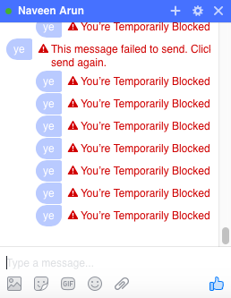

# Practice Projects
This repo is a test bed for using new tools.

### Excel Viewer
Using Node.js, broadcast a live stream of 5x5 cells from `example.xlsx`.

### Ye
Mac software that spams "ye" in chat. Input is rate-limited at 1 message/sec because anything faster will cause Facebook to temporarily block you:

### saa-d
Website I'm building for a Redditor.
